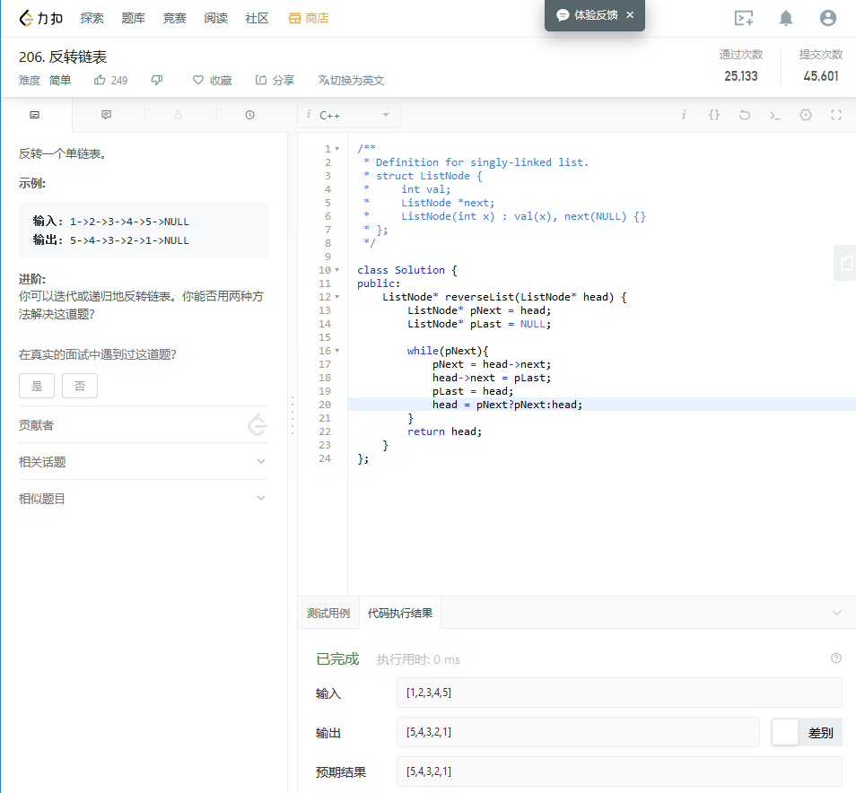
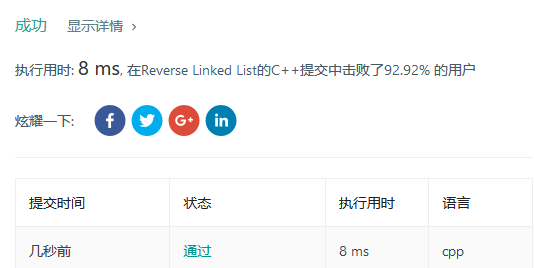

# C++ 反转链表 1 迭代
## code
```
/**
 * Definition for singly-linked list.
 * struct ListNode {
 *     int val;
 *     ListNode *next;
 *     ListNode(int x) : val(x), next(NULL) {}
 * };
 */

class Solution {
public:
    ListNode* reverseList(ListNode* head) {
        ListNode* pNext = head;
        ListNode* pLast = NULL;
        
        while(pNext){
            pNext = head->next;
            head->next = pLast;
            pLast = head;
            head = pNext?pNext:head;
        }
        return head;
    }
};
```
## 说明
1. 遍历，并移动指针

## 截图





